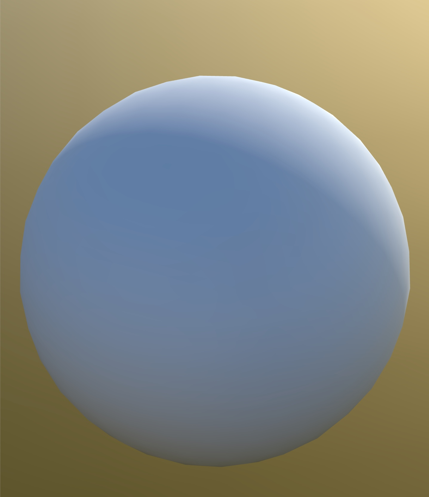

 # [procedural-terrain](https://procedural-terrain.kyledlong.com/)

This project showcases WebGL shaders implemented using React Three Fiber (R3F). 
<br>



## Tech

|                   |               |
| ----------------- | ------------- |
| React Three Fiber | WebGL         |
| JS                | Three.js      |
| HTML              | CSS           |
| Vite              | shaders       |


## How to Use
<br>

1. Clone the repository:

```bash
git clone https://github.com/KD-Long/procedural-terrain.git
```

2. Install the dependencies:

```bash
cd procedural-terrain
npm install
```

3. Run the project:

```bash
npm run dev
```

3. Open your web browser and navigate to http://localhost:5173 to access the project.

# Notes to self

